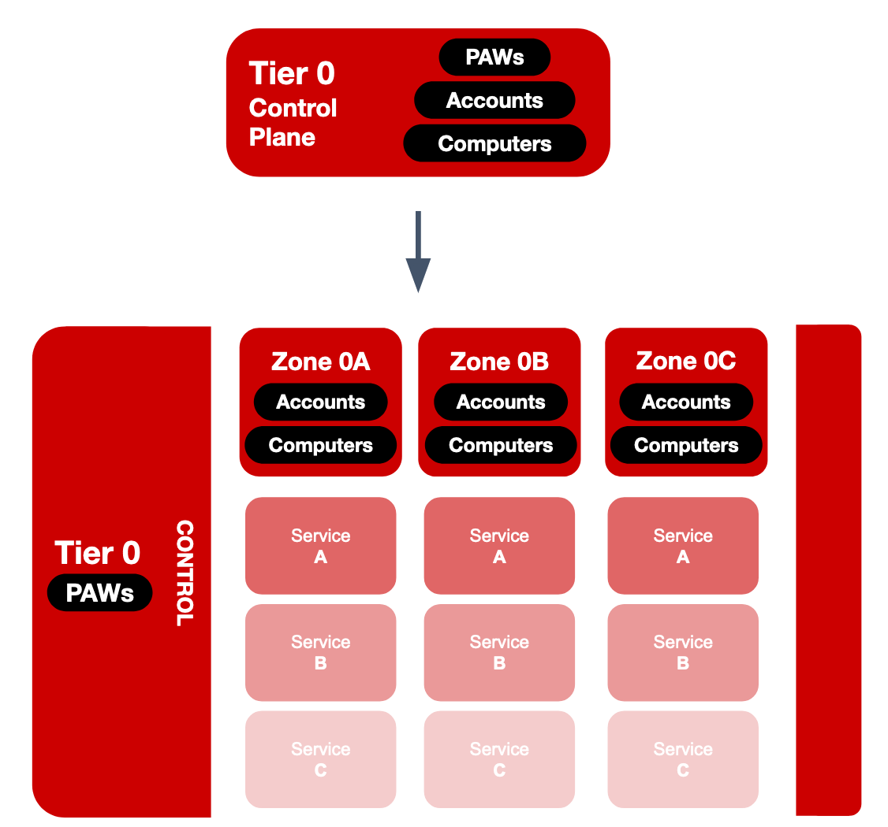
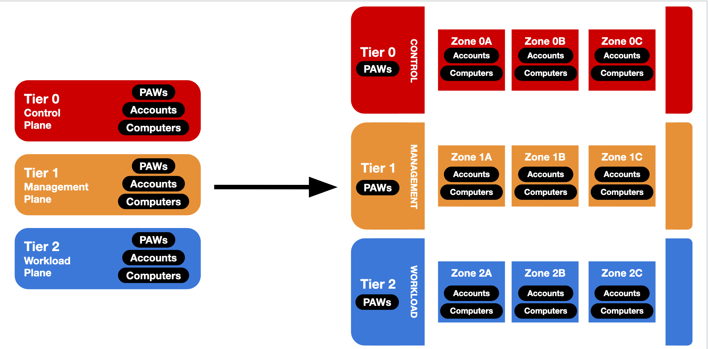
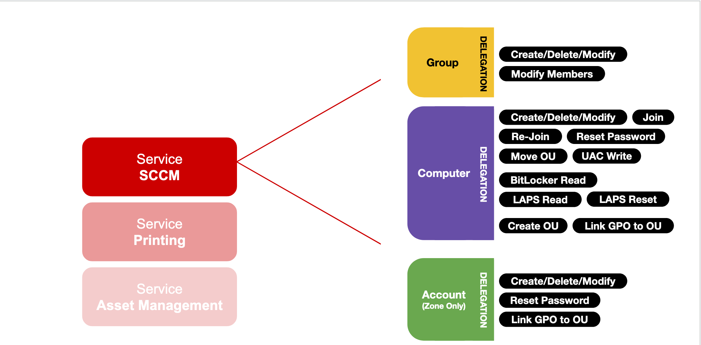

# Monash Enterprise Access Model (MEAM)

# Overview
This document provides a high-level overview of the "Monash Enterprise Access Model" (MEAM) - a model for tiering Active Directory that builds heavily on the [Microsoft Enterprise Access Model](https://learn.microsoft.com/en-us/security/privileged-access-workstations/privileged-access-access-model).

The MEAM was developed by the Enterprise Engineering team at Monash University, Australia.

The MEAM builds on three core components:
- The __administrative tier__: an "macro" partition of AD based on the level of privilege & control.
- The __zone__: a horizontal split of a *tier*, where *services* are placed into *silos* preventing lateral movement.
- The __service__: a delegation target within a *zone*, containing computers and groups.

__TL;DR__: The MEAM brings microsegmentation to AD, using entirely built-in functionality.

## Administrative Tiers

The first concept in the MEAM builds on the *tiering* concept from the [Microsoft Enterprise Access Model](https://learn.microsoft.com/en-us/security/privileged-access-workstations/privileged-access-access-model).

This model prevents escalation of privilege by restricting what admins can __control__ and where they can __log on__.

> The Three Commandments of the AD Administrative Tier Model:
> - Rule #1: Credentials from a higher-privileged tier must not be exposed to lower-tier systems.
> - Rule #2: Lower-tier credentials can use services provided by higher-tiers, but not the other way around.
> - Rule #3: Any system or user account that can manage a higher tier is also a member of that tier, whether originally intended or not.
> 
> -- [Protecting Tier 0 the Modern Way](https://techcommunity.microsoft.com/t5/core-infrastructure-and-security/protecting-tier-0-the-modern-way/ba-p/4052851)

### PAWs

We want to ensure that all privilege access happens on a trusted device.

This is where PAWs - Privileged Access Workstations - come in.

A Privileged Access Workstation (PAW) is a dedicated workstation for sensitive tasks, and it gives administrators a secure device to work from.
- A PAW is for management only - it can’t be used for on-administrative tasks, such as email and web browsing.
- A user is given a “day-to-day” VM or SOE Device where they can do their “productivity work”

The PAW design ensures that there is a secure, hardware-based root of trust for all privileged management. PAWs are deliberately locked down to serve one purpose: administering critical systems.

---

A PAW provides increased security for admins working with high risk servers and applications; in many cases, certain tasks can be made to require a PAW.

For example, this might be:
- Managing AD itself
- Managing secure databases
- Managing services that can take control of the environment (like SCCM)

Their are PAWs in each tier of the environment, so while a “domain admin” would have a Tier 0 PAW, a workstation administrator would have a Tier 1 PAW.

So, what makes a PAW trusted?
- All hardware-based security mechanisms enabled.
- Restricted access to the internet; always connected to a trusted network
- Hardware based authentication (e.g., smartcards)
- Highly monitored and audited

All in all, the use of PAWs means that privileged credentials only appear on secure systems.

## Zones

The first “new” concept in the MEAM model is what we’ve called a "zone" - The term zone comes from “blast zone”, and they break up big tiers into smaller "chunks".

Zones group accounts and computers together, and we prevent authentication between zones. By splitting tiers up, we reduce the blast radius of an attack. The core concept is simple: if one zone is compromised, neighbors should not be affected.

In other words, if a bomb goes off in one zone, the zone’s neighbors are shielded.

Zones enclose accounts, servers and computers in *Authentication Silos*, where the actions in one zone cannot impact another.

Everything in a zone has a common purpose. Machines and accounts within a zone can authenticate to one another, but can’t authenticate outside of their own zone.

The name ‘zone’ comes from ‘blast zone’. This is important to keep in mind when interacting with resources in zones: they are a security boundary to ensure that compromises in one area do not lead to large-scale breaches.

Zones are named in the form "Zone (0|1|2)[A-Z]", where:
  - The numeric portion corresponds to the Tier identifier, and
  - The alphabetic portion is a unique Zone identifier

### Accounts

Each *zone* in the MEAM acts as a container for *accounts*. Privileged accounts in the MEAM - especially those in Tier 1 or above - are typically referred to as 'zoned accounts'.

As an administrator, a user is responsible for administrative accounts in each zone they have access to. There are no privileged accounts that can be used across zones.

Administrative accounts typically look something like:
> z1g-mgr-jsmi0001

This can be broken down into three parts:
- "z1g": This account sits in Zone 1G (Tier 1 / Zone G).
- "mgr": This is a management account
- "jsmi0001": This account is owned by the user with the standard account name “jsmi0001”

These accounts only work on PAWs and machines within the user's zone; authentication will be rejected anywhere else.

In the MEAM, all "zoned" *user* accounts are also members of the [Protected Users Security Group](https://learn.microsoft.com/en-us/windows-server/security/credentials-protection-and-management/protected-users-security-group), and are afforded all protections that this group offers.
  - *Note*: "gMSA"-style service accounts, of course, are *not* members of the Protected Users security group.

#### Authentication

All zoned user accounts require smartcard authentication - typically using a PIV token such as a [Yubikey](https://developers.yubico.com/yubico-piv-tool/YubiKey_PIV_introduction.html).
- *Note*: it is recommended to automatically rotate the underlying password on smartcard-only accounts, as the enforcement step will only scramble the password once.

Where possible, zoned *service accounts* are configured as gMSAs.

### Enforcement

#### Authentication Policy Silos

At the core of the “zone” model is an AD feature called "Authentication Policy Silos"

Authentication Silos and Authentication Policies are a new-ish AD feature. By “new-ish”, we mean they became available in Server 2012 R2.

At the most basic level, they are essentially an account/device firewall build into AD that locks specific accounts to specific machines, or vice-versa.

In the MEAM, we have implemented Authentication Silos and Policies in two ways:
- __PAW Silos__: Per-tier "computer" silos that contain PAW machines.
  - Only PAW Users in a specific tier can authenticate.
- __Zone Silos__: Per-zone "user" silos that contain user and service accounts.
  - Users in a zone can only authenticate to:
    - PAW devices
    - Computers within their own zones
    - *DA Silos only*: Domain Controllers

_References_:
- Authentication Silos build on [Kerberos FAST](https://trustedsec.com/blog/i-wanna-go-fast-really-fast-like-kerberos-fast) and [Kerberos claims, compound authentication and armoring](https://learn.microsoft.com/en-us/previous-versions/windows/it-pro/windows-server-2012-r2-and-2012/hh831747(v=ws.11)#support-for-claims-compound-authentication-and-kerberos-armoring).
- The documentation for 'Authentication Policies and Authentication Policy Silos' can be found [here](https://learn.microsoft.com/en-us/windows-server/security/credentials-protection-and-management/authentication-policies-and-authentication-policy-silos).
- For a getting-started guide on configuring Authentication Silos, check out this [step by step guide](https://fitzwindowsblog.blogspot.com/2024/05/step-by-step-guide-to-setting-up.html).
- Another great reference is [Protecting Tier 0 the Modern Way](https://techcommunity.microsoft.com/t5/core-infrastructure-and-security/protecting-tier-0-the-modern-way/ba-p/4052851) from the [Microsoft `Core Infrastructure and Security Blog`](https://techcommunity.microsoft.com/t5/core-infrastructure-and-security/bg-p/CoreInfrastructureandSecurityBlog)

#### User Rights Assignment

Along with *Authentication Policy Silos*, this AD model utilizes *User Rights Assignments* to enforce AuthZ at the endpoint.

If *Authentication Silos* are the __AuthN__ protection, *URAs* are the __AuthZ__ protection.

Silos and URAs work in tandem to ensure the right identity has access and authentication to the right service. 

### Zones in Practice

Taking a standard environment, there are many ways one could split *tiers* into *zones*.

A good way to think about it is though the 'Enterprise Access Model's view of "control"; we want to ensure that zones can be *segmented* from each other to ensure that if one is breached, the impact is as small as possible.

---

One approach may look like:

- Tier 0
  - Zone 0A - Domain Management
  - Zone 0B - Secure Hypervisior Management
- Tier 1
  - Zone 1A - Workstation Management 
  - Zone 1B - Server Management
  - Zone 1C - Storage Management
  - Zone 1D - Hypervisor Management
- Tier 2
  - Zone 2A - Workstations
  - Zone 2B - Servers

Where:
- `Zone 2A (Workstations)` is managed by `Zone 1A (Workstation Management)`
- `Zone 2B (Servers)` is managed by `Zone 1B (Server Management)`

In this way, we can ensure that a breached 'Workstation Management' zone has no effect on the 'Servers' zone, etc.

## Services

In the MEAM, *zones* are split into *services*.

Since multiple people (or even teams) may manage different *services* within a zone, we want to delegate permissions for management of specific *computers* and *groups*.

For each *service* in a *zone*, around ~18 different delegation groups created - allowing specific, fine-grained rights to be delegated out to administrators or service accounts.

### Services in Practice

Take the zone we discussed earlier - `Zone 1A - Workstation Management`.

A workstation management zone may have a number of services, for example:
  - SCCM
  - Asset Management
  - Printing

In the MEAM, each of the above gets it's own OU underneath the *Zone 1A* zone container.

Computers and groups related to *SCCM* can have permissions delegated separately to those in the *Printing* service.

Granting a permission to a user, such as "ComputerDomainJoin", is accomplished simply by adding their account to a `Z1A-DLG-SCCM-Computers-ComputerDomainJoin` group, which is far easier than managing potentially hundreds of thousands of DACL rules!

# Resources

- [MEAM - Active Directory OU Structure](./STRUCTURE.md)
- [MEAM - Active Directory Delegation](./DELEGATION.md)
- [MEAM - Active Directory Authentication Silos](./SILOS.md)